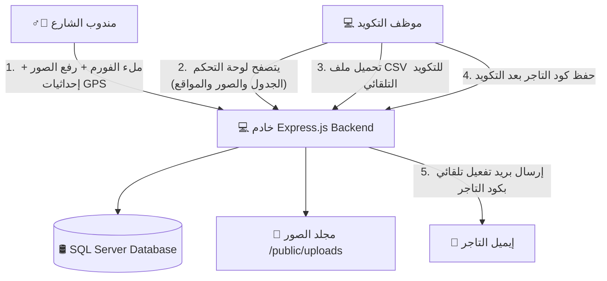

# يلا تاجر - نظام تسجيل وتكويد بيانات التجار 🚀
### Yalla Tager - Merchant Coding Form & Dashboard

نظام ويب متكامل مصمم خصيصاً لمشروع **"يلا تاجر"** لتسهيل عملية جمع بيانات التجار من مناديب الشارع وتكويدها بواسطة فريق العمل الخلفي (Backoffice)، بدلاً من الاعتماد على مجموعات الواتساب التقليدية التي تتسبب في بطء العمل وتساقط البيانات.

---

## 📊 مخطط هيكلية النظام (System Architecture)

يوضح المخطط التالي دورة حياة البيانات وانسيابيتها بين مندوب الشارع، السيرفر، قاعدة البيانات، وموظف التكويد:



---

## 📂 هيكلية ملفات المشروع (Project Folder Structure)

يحتوي المشروع على هيكلية منظمة تفصل بين الباك إند (Backend) والفرونت إند (Frontend) كالتالي:

```text
yallatagerform/
├── public/                       # ملفات الفرونت إند (الواجهة الأمامية) المتاحة للعامة
│   ├── uploads/                  # مجلد تخزين الصور المرفوعة (واجهة المتجر والبطاقات)
│   ├── favicon.png               # أيقونة التبويب الصغيرة في المتصفح (اللوجو المربع)
│   ├── yalla_tager_logo.png      # شعار يلا تاجر الرئيسي المستخدم في الواجهات (اللوجو الأفقي)
│   ├── index.html                # صفحة فورم التسجيل الخاصة بمندوب الشارع (عربي / إنجليزي)
│   ├── app.js                    # منطق فورم المندوب (الـ GPS، معاينة الصور، رفع البيانات)
│   ├── dashboard.html            # لوحة تحكم فريق التكويد (عرض البيانات، الفلاتر، التصدير)
│   ├── dashboard.js              # منطق لوحة التحكم (التفاعل، التصدير كـ CSV، الحفظ والتفعيل)
│   ├── login.html                # صفحة تسجيل دخول المدراء والمسؤولين
│   ├── login.js                  # منطق صفحة تسجيل الدخول والتحقق من الجلسة
│   └── styles.css                # ملف التنسيق الجمالي المشترك (تصميم Premium متجاوب)
├── .env                          # ملف متغيرات البيئة السرية (بيانات الاتصال بالسيرفر والـ SMTP وخدمة الاستعلام)
├── server.js                     # الملف الرئيسي للباك إند (سيرفر Express والاتصال بقاعدة البيانات ومسارات الأمان)
└── package.json                  # ملف تعريف المشروع وإدارة المكتبات والاعتماديات
```

### 📝 شرح تفصيلي لكل ملف:
* **[public/uploads/](file:///c:/Users/SMART%20HOME/Documents/Uni-Group/yallatagerform/public/uploads)**: مجلد تخزين صور واجهات المحلات وبطاقات الرقم القومي المرفوعة بواسطة المناديب.
* **[public/favicon.png](file:///c:/Users/SMART%20HOME/Documents/Uni-Group/yallatagerform/public/favicon.png)**: شعار يلا تاجر المربع، مخصص للظهور في تبويبات المتصفح الصغيرة لإضفاء طابع احترافي.
* **[public/yalla_tager_logo.png](file:///c:/Users/SMART%20HOME/Documents/Uni-Group/yallatagerform/public/yalla_tager_logo.png)**: الشعار الأفقي الرسمي المندمج مع خلفية الصفحة والمستخدم كعنوان رئيسي.
* **[public/index.html](file:///c:/Users/SMART%20HOME/Documents/Uni-Group/yallatagerform/public/index.html)**: واجهة فورم التسجيل للمندوب، وتدعم اللغتين وتغيير اتجاهات الصفحة بالكامل.
* **[public/app.js](file:///c:/Users/SMART%20HOME/Documents/Uni-Group/yallatagerform/public/app.js)**: كود الواجهة المسؤول عن تشغيل الـ GPS، إظهار صور المعاينة قبل الرفع، وإرسال الفورم مع إظهار شريط التحميل.
* **[public/dashboard.html](file:///c:/Users/SMART%20HOME/Documents/Uni-Group/yallatagerform/public/dashboard.html)**: لوحة تحكم موظفي التكويد لعرض جدول التجار المسجلين وتصفيتهم.
* **[public/dashboard.js](file:///c:/Users/SMART%20HOME/Documents/Uni-Group/yallatagerform/public/dashboard.js)**: المسؤول عن التفاعل في لوحة التحكم، تحميل ملف الـ CSV وتحديث الحالة، وحفظ كود التاجر وتفعيل حسابه.
* **[public/login.html](file:///c:/Users/SMART%20HOME/Documents/Uni-Group/yallatagerform/public/login.html)**: بوابة تسجيل الدخول المؤمنة بالكامل والمحمية ضد الدخول غير المصرح به للوحة التحكم.
* **[public/login.js](file:///c:/Users/SMART%20HOME/Documents/Uni-Group/yallatagerform/public/login.js)**: يتعامل مع نداءات المصادقة بالباك إند، ويولد ملفات التوثيق ويحفظ الجلسة الآمنة.
* **[public/styles.css](file:///c:/Users/SMART%20HOME/Documents/Uni-Group/yallatagerform/public/styles.css)**: التنسيق الجمالي العام؛ يعتمد على خط Cairo والتأثيرات الحركية (Transitions) لضمان تجربة مستخدم راقية ومتجاوبة مع الهواتف الذكية.
* **[.env](file:///c:/Users/SMART%20HOME/Documents/Uni-Group/yallatagerform/.env)**: ملف خارجي لتخزين متغيرات بيئة العمل (مثل بورت السيرفر، خيارات تشفير وتفاصيل اتصال SQL Server، وحساب الـ SMTP لإرسال الإيميلات) لضمان الأمان والسهولة عند النقل للإنتاج.
* **[server.js](file:///c:/Users/SMART%20HOME/Documents/Uni-Group/yallatagerform/server.js)**: الكود الرئيسي للباك إند، يستقبل البيانات والصور، يقوم بالاتصال بـ SQL Server، يولد ملفات الـ CSV، ويرسل البريد الإلكتروني للتاجر.
* **[package.json](file:///c:/Users/SMART%20HOME/Documents/Uni-Group/yallatagerform/package.json)**: يحتوي على سجل المكتبات المستخدمة وأوامر التشغيل.

---

## 📚 التقنيات والمكتبات المستخدمة (Tech Stack & Libraries)

### 1. الباك إند (Backend):
* **Node.js (Express.js)**: البيئة البرمجية والإطار الأساسي لبناء السيرفر ومسارات الـ API.
* **[mssql](https://www.npmjs.com/package/mssql)** (Tedious Driver): المكتبة الرسمية الموصى بها للاتصال بقواعد بيانات Microsoft SQL Server بأمان وحماية من الـ SQL Injection عبر Parameterized Queries.
* **[multer](https://www.npmjs.com/package/multer)**: مكتبة لمعالجة ورفع الملفات والصور (Multipart/Form-Data) وحفظها محلياً بأسماء فريدة لمنع الكتابة فوق الملفات القديمة.
* **[nodemailer](https://www.npmjs.com/package/nodemailer)**: لإرسال إيميلات التفعيل التلقائية للتجار عبر بروتوكول SMTP بمجرد قيام فريق العمل بتكويدهم.
* **[dotenv](https://www.npmjs.com/package/dotenv)**: لتحميل متغيرات البيئة السرية من ملف `.env`.

### 2. الواجهة الأمامية (Frontend):
* **HTML5 & CSS3 Vanilla**: لضمان أقصى درجات التحكم في الواجهة والمرونة والتوافق مع محركات البحث SEO.
* **JavaScript (ES6+)**: للتحكم التفاعلي بالصفحات بدون الحاجة لأطر عمل معقدة تبطئ التحميل على الهواتف.
* **Bootstrap Icons (v1.11.3)**: مكتبة الأيقونات الرسمية المستخدمة بدلاً من الإيموجيز لتوفير واجهات متناسقة وراقية.
* **HTML5 Geolocation API**: للحصول على إحداثيات موقع المحل الدقيقة عبر GPS الهاتف مباشرة.
* **CSS mix-blend-mode**: لمعالجة خلفيات الشعارات المرفوعة ودمجها تلقائياً مع خلفية الصفحة لتظهر شفافة وبدون حدود مربعة.

---

## 🌟 الميزات المتقدمة وتجربة المستخدم (Advanced UX Features)

1. **البحث السريع والفوري (Instant Client-Side Search)**: شريط بحث مخصص في لوحة التحكم يتيح تصفية وفحص التجار لحظياً بكتابة الاسم، رقم الهاتف، أو الإيميل بدون إعادة تحميل الصفحة.
2. **نافذة التكويد المنبثقة (Activation Modal)**: تم استبدال حقول الإدخال المكدسة في الجدول بـ Modal تفاعلي أنيق يظهر بضغطة زر لتكويد التاجر وتفعيل حسابه مباشرة.
3. **تنزيل ملفات الـ CSV البرمجي (AJAX Blob Download)**: يتم تحميل وتصدير ملفات البيانات بالكامل في الخلفية باستخدام كائن Blob دون فتح تبويبات فارغة أو الانتقال لصفحات أخرى، ومعالجة عدم وجود بيانات برسائل تنبيهية لطيفة.
4. **التحديث التلقائي الذكي (Smart Auto-Refresh)**: عداد تنازلي نشط (60 ثانية) يظهر حالة السيرفر، مع دوران أيقونة التحديث حركياً لتوضيح نشاط النظام وجلب أي تجار جدد في الوقت الفعلي.
5. **بوابة اختيار نوع العميل (Entry Gateway)**: قبل فتح الفورم يظهر للمستخدم خياران — **عميل يلا تاجر** (يستعلم برقم هاتفه أولاً) أو **مبيعات على الأرض** (يدخل الفورم مباشرة ويسجّل كل البيانات مرة واحدة).
6. **الاستعلام الفوري عن حالة التكويد (Coding Status Lookup)**: عميل يلا تاجر يدخل رقم هاتفه فيستعلم النظام من السيرفيس الخارجي ويعرض له حالته فوراً (متكوّد / بانتظار فريق التكويد / لا توجد بيانات).
7. **حماية خصوصية التجار (7-Day Privacy Window)**: بيانات أي تاجر تُعرض فقط إذا كان تاريخ تسجيله من اليوم وراجع 7 أيام. أقدم من ذلك تظهر رسالة "عذراً تعذر عرض البيانات" — والقرار يُتخذ في السيرفر فلا تصل البيانات المحجوبة للمتصفح إطلاقاً.
8. **تحديد المصدر في لوحة التحكم (Source Tracking)**: كل سجل يحمل مصدره (عميل يلا تاجر / مبيعات على الأرض) ويظهر كشارة ملوّنة في الجدول مع فلتر مخصص وعمود في ملف الـ CSV.
9. **حد المعدل بدل الكابتشا (Rate Limiting)**: تم إزالة الكابتشا من الفورم بالكامل، واستُبدلت بحد معدل على مستوى السيرفر يمنع تعداد أرقام الهواتف (enumeration) وإغراق النظام بالطلبات.

---

## ⚙️ إعداد بيئة العمل والتشغيل (Setup Guide)

### 1. تهيئة خادم SQL Server محلياً:
لكي يتمكن التطبيق من الاتصال بـ SQL Server Express على جهازك، يجب تفعيل الاتصال عبر الشبكة وصلاحية المصادقة المختلطة كالتالي:
1. افتح **SQL Server Configuration Manager**.
2. اذهب إلى **SQL Server Network Configuration** -> **Protocols for SQLEXPRESS**.
3. اضغط بزر الماوس الأيمن على **TCP/IP** واختر **Enable**.
4. اضغط مرتين على **TCP/IP**، ثم انتقل لتبويب **IP Addresses**، وانزل لـ **IPAll** واجعل حقل *TCP Dynamic Ports* فارغاً، واكتب في حقل *TCP Port* القيمة `1433`.
5. افتح برنامج **SSMS**، واضغط بزر الماوس الأيمن على السيرفر واختر **Properties** -> صفحة **Security** -> فعل خيار **SQL Server and Windows Authentication mode** (المصادقة المختلطة).
6. فعل مستخدم الـ `sa` واكتب له كلمة مرور قوية.
7. اذهب لـ **SQL Server Services** واعمل **Restart** للخدمة **SQL Server (SQLEXPRESS)**.

### 2. ضبط ملف الإعدادات:
افتح ملف `.env` وقم بتعديله كالتالي:
```env
PORT=3000

# إعدادات SQL Server
DB_SERVER=localhost\SQLEXPRESS
DB_PORT=1433
DB_DATABASE=YallaTagerForm
DB_USER=sa
DB_PASSWORD=اكتب_هنا_باسورد_ال_sa
DB_ENCRYPT=false
DB_TRUST_SERVER_CERTIFICATE=true

# إعدادات إرسال الإيميل (SMTP)
SMTP_HOST=smtp.gmail.com
SMTP_PORT=587
SMTP_SECURE=false
SMTP_USER=بريدك_الإلكتروني
SMTP_PASS=كلمة_مرور_التطبيقات
SMTP_FROM="Yalla Tager <no-reply@yallatager.com>"

# إعدادات خدمة الاستعلام عن التاجر (Merchant Lookup Service)
# يستخدمها مسار "عميل يلا تاجر". المفتاح إلزامي وإلا رجع /api/lookup خطأ 503.
LOOKUP_API_URL=https://endpoints.svei.tech/api/YTGOnline/CheckMerchantForCoding
LOOKUP_API_KEY=مفتاح_الـ_API_الخاص_بك
LOOKUP_RECENT_DAYS=7
LOOKUP_TIMEOUT_MS=15000

# حدود المعدل (بديل الكابتشا التي تم إزالتها)
LOOKUP_RATE_WINDOW_MS=60000
LOOKUP_RATE_MAX=15
SUBMIT_RATE_WINDOW_MS=600000
SUBMIT_RATE_MAX=10

```

### 3. التشغيل:
افتح موجه الأوامر في مجلد المشروع، ثم شغل الأمر:
```bash
npm install      # أول مرة فقط
npm start        # أو: npm run dev  (مع إعادة التشغيل التلقائي)
```
سيقوم السيرفر بالعمل على المنفذ: `http://localhost:3000` وسيقوم تلقائياً بفحص السيرفر وإنشاء قاعدة البيانات وجدول التجار بدون أي تدخل يدوي.

الصفحات المتاحة بعد التشغيل:

| الصفحة | المسار | الوصف |
| :--- | :--- | :--- |
| فورم مندوب الشارع | `http://localhost:3000/` | تسجيل بيانات التاجر الجديد (متاحة للعامة) |
| تسجيل دخول المسؤولين | `http://localhost:3000/login.html` | بوابة الدخول للوحة التحكم |
| لوحة تحكم التكويد | `http://localhost:3000/dashboard.html` | محمية بالكوكيز — تحوّل للـ login عند عدم الدخول |

**بيانات الدخول الافتراضية** (يتم إنشاؤها تلقائياً عند أول تشغيل فقط):

```text
اسم المستخدم : admin
كلمة المرور  : YallaTagerAdmin2026
```
> ⚠️ غيّر هذه البيانات فوراً في بيئة الإنتاج عن طريق `DEFAULT_ADMIN_USERNAME` و `DEFAULT_ADMIN_PASSWORD` في ملف `.env` قبل أول تشغيل، أو بإضافة مسؤول جديد من زر "إدارة المسؤولين" داخل لوحة التحكم.

---

## 🗄️ أوضاع تخزين البيانات (Storage Drivers)

النظام يعتمد على طبقة وصول للبيانات في ملف `db.js` تدعم وضعين، ويتم اختيار الوضع من المتغير `DB_DRIVER` في `.env`:

| القيمة | السلوك | الاستخدام المناسب |
| :--- | :--- | :--- |
| `auto` (الافتراضي) | يحاول الاتصال بـ SQL Server، وإذا فشل يستخدم ملفات JSON محلية تلقائياً | التطوير والتجربة السريعة |
| `mssql` | SQL Server إلزامي — يتوقف السيرفر إذا فشل الاتصال | **الإنتاج (Production)** |
| `file` | ملفات JSON محلية فقط بدون أي قاعدة بيانات | تجربة الواجهات بسرعة |

في الوضع المحلي (`file`) يتم تخزين البيانات في ملفين مستثنيين من الـ Git:
* `fallback_db.json`   — بيانات التجار
* `fallback_users.json` — حسابات المسؤولين

> 💡 هذا يعني أن الفورم ولوحة التحكم يعملان بالكامل حتى على جهاز لا يوجد به SQL Server، ثم عند الانتقال للإنتاج تضبط `DB_DRIVER=mssql` وبيانات الاتصال فيعمل نفس الكود على SQL Server بدون أي تغيير.

### التشغيل كخدمة دائمة (PM2)
لتشغيل السيرفر في الخلفية مع إعادة التشغيل التلقائي عند الأعطال:
```bash
npm install -g pm2
pm2 start ecosystem.config.cjs
pm2 logs yallatager --nostream    # مراجعة السجلات
pm2 restart yallatager            # إعادة التشغيل
pm2 stop yallatager               # الإيقاف
```

---

## 🌐 تفاصيل مسارات الـ API (API Reference)

> **⚠️ ملاحظة هامة للنشر (Production):** جميع نداءات الـ API البرمجية في كود الفرونت إند تم صياغتها بمسارات نسبية (Relative Paths) بدون شرطة مائلة بادئة (e.g. `api/merchants` بدلاً من `/api/merchants`). هذا يضمن توافق النظام تماماً مع خوادم البرودكشن ووكلاء التمرير العكسي (Reverse Proxies مثل Nginx) في حال تم استضافة التطبيق تحت مجلد فرعي (Subdirectory).

| المسار (Route) | نوع الطلب (Method) | الوصف (Description) | المدخلات (Payload) |
| :--- | :--- | :--- | :--- |
| `api/lookup` | `GET` | الاستعلام عن حالة تكويد تاجر بالرقم (عام + محدود المعدل) | `query param` واحد `?phone=01xxxxxxxxx` |
| `api/config` | `GET` | إعدادات عامة للواجهة (نافذة الخصوصية بالأيام) | لا يوجد |
| `api/merchants` | `POST` | إرسال بيانات تاجر جديد (محدود المعدل، بدون كابتشا) | `FormData` (الحقول النصية + `source` + الملفات الثنائية للصور) |
| `api/merchants` | `GET` | جلب قائمة التجار للوحة التحكم | `query params` (status, downloaded, uploaded) |
| `api/merchants/export/csv` | `GET` | تحميل ملف CSV للتجار **الجدد فقط** (`downloaded = 0`) | لا يوجد (يقوم بتحديث `downloaded=1` تلقائياً لكل ما تم تحميله) |
| `api/merchants/export/csv` | `POST` | إعادة تحميل **السجلات المحددة** مهما كانت حالتها | `json` مصفوفة معرّفات `{ ids: [1, 2, 3] }` — **لا يغيّر** حالة `downloaded` |
| `api/merchants/reset-downloaded` | `POST` | إرجاع سجلات لحالة "لم يتم التحميل" لتظهر في تحميل الجدد | `json` مصفوفة معرّفات `{ ids: [1, 2, 3] }` |
| `api/merchants/mark-uploaded` | `POST` | تعليم مجموعة تجار كـ "تم الرفع" | `json` يحتوي على مصفوفة معرّفات `{ ids: [1, 2, 3] }` |
| `api/merchants/:id/code` | `POST` | تكويد تاجر وحفظ كوده وإرسال إيميل التفعيل | `json` يحتوي على كود التاجر الجديد `{ merchant_code: "YT-XXXX" }` |
| `api/security/overview` | `GET` | تقرير مراقبة الاستعلامات والأمان (يتطلب تسجيل دخول) | لا يوجد |
| `api/security/acknowledge` | `POST` | تعليم التنبيهات الحالية كـ "تمت مراجعتها" | لا يوجد |

---

## 🔄 مسارات الدخول وقواعد العمل (Entry Flows & Business Rules)

قبل ظهور فورم التسجيل يختار المستخدم مساره من شاشة البداية:

```
                    ┌──────────────────────────────┐
                    │   شاشة البداية (Gateway)     │
                    └───────────┬──────────────────┘
                 ┌──────────────┴───────────────┐
                 ▼                              ▼
      "عميل يلا تاجر"                 "مبيعات على الأرض"
   يدخل رقم الهاتف للاستعلام        ليس لديه رقم مسبق ⇒ يدخل
                 │                    الفورم مباشرة ويسجّل كل
                 ▼                    البيانات مرة واحدة (كود
                                       المشرف اختياري)
        GET api/lookup?phone=01xxxxxxxxx        (source=field_sales)
                 │
    ┌────────────┼────────────┬─────────────────┐
    ▼            ▼            ▼                 ▼
already_coded  awaiting_   privacy_          not_found
               coding      restricted
```

### الحالات الأربع للاستعلام

| الحالة (status) | المعنى | ما يظهر للمستخدم |
| :--- | :--- | :--- |
| `already_coded` | التاجر لديه `merchantCode` بالفعل | ✅ كود التاجر + بياناته — "متكوّد وتمام، مفيش مشكلة" |
| `awaiting_coding` | موجود لكن بدون كود (بياناته كاملة أو ناقصة) | ⏳ بقية البيانات + "الدنيا واقفة عند فريق التكويد دلوقتي" |
| `privacy_restricted` | تاريخ تسجيله أقدم من نافذة الـ 7 أيام | 🔒 "عذراً، تعذر عرض البيانات" — **بدون أي بيانات إطلاقاً** |
| `not_found` | الرقم غير موجود في السيرفيس | 🚫 "الرقم غير مسجّل في يلا تاجر — يرجى إنشاء حساب" — **لا يُفتح أي فورم** |

### قاعدة الخصوصية (نافذة الـ 7 أيام)

* يُعرض سجل التاجر فقط إذا كان `creationDate` **من اليوم وراجع 7 أيام** (`0 ≤ العمر ≤ 7`).
* أقدم من ذلك ⇒ الحالة `privacy_restricted` وتظهر رسالة "عذراً تعذر عرض البيانات" لحماية خصوصية التجار المسجّلين.
* التواريخ المستقبلية تُعامل كغير موثوقة (لا تُعرض) تحفظاً.

### الرقم غير المسجّل (not_found)

شاشة الاستعلام مخصّصة **للتجار المسجّلين بالفعل** في يلا تاجر. لو الرقم غير موجود
في السيرفيس، لا يُفتح فورم إدخال بيانات، وإنما تظهر رسالة تطلب إنشاء حساب على يلا
تاجر أولاً ثم العودة للاستعلام. أما إدخال بيانات تاجر جديد فيتم من مسار
**مبيعات على الأرض** (`source=field_sales`).
* **القرار يُتخذ في السيرفر داخل `services/merchantLookup.js`**، واستجابة الحالة المحجوبة تحتوي على `status` و `phone` و `windowDays` فقط — لا اسم ولا إيميل ولا كود. فلا يمكن استخراج البيانات من شبكة المتصفح.
* عدد الأيام قابل للتعديل عبر `LOOKUP_RECENT_DAYS` في `.env`.

### تطبيع أرقام الهواتف (Phone Normalization)

السيرفيس الخارجي يطابق الأرقام بالصيغة المحلية فقط (`01xxxxxxxxx`)، وصيغة `+20` ترجع `data: null`. لذلك يطبّع النظام الرقم قبل الإرسال وقبل الحفظ:

| المُدخل | بعد التطبيع |
| :--- | :--- |
| `+201114004024` / `201114004024` / `00201114004024` | `01114004024` |
| `1114004024` | `01114004024` |
| `011-140-04024` / `011 1400 4024` | `01114004024` |

---

## 📥 أوضاع تحميل الـ CSV وحالة "تم التحميل" (Export Modes & the `downloaded` Flag)

كل سجل في الجدول عليه علامة (flag) اسمها `downloaded` بجانبها تاريخ `downloaded_at`، ودورها **دفتر متابعة** يقول: "هذا السجل خرج بالفعل في ملف CSV مرة" — حتى لا يُسلَّم نفس التاجر لفريق التكويد مرتين.

### لماذا كان عمود "CSV" يقول "نعم" لكل السجلات؟

زر **تحميل البيانات الجديدة** لا يحمّل سجلاً واحداً؛ بل يحمّل **كل** السجلات التي حالتها `downloaded = 0` في الملف، ثم يعلّمها كلها `downloaded = 1` دفعة واحدة. فالضغطة الواحدة تشمل كل الجدود، ومن ثم يصبح العمود "نعم" للجميع — وهذا هو التصرف المقصود، لكن كان ينقصه أمران:

1. لا توجد طريقة لإعادة تحميل سجل خرج مرة، لأن `getUndownloadedMerchants()` يرجع فقط `downloaded = 0`.
2. لا يوجد تراجع (undo) عن العلامة إذا ضُغط الزر بالخطأ أو تلف الملف.

تمت معالجة النقطتين بإضافة وضعين جديدين للتحميل بجانب الوضع الأصلي:

| الزر في لوحة التحكم | المسار | ماذا يحمّل؟ | تأثيره على علامة `downloaded` |
| :--- | :--- | :--- | :--- |
| **تحميل البيانات الجديدة (CSV)** | `GET api/merchants/export/csv` | السجلات الجديدة فقط (`downloaded = 0`) | ✅ يعلّمها `1` مع تسجيل الوقت |
| **تحميل المحدد (CSV)** | `POST api/merchants/export/csv` | السجلات المُعلَّمة بالـ checkbox، **مهما كانت حالتها** | ⛔ لا يمسّها إطلاقاً (الأرشيف يبقى سليماً) |
| **إرجاع كـ غير محمّل** | `POST api/merchants/reset-downloaded` | لا يحمّل شيئاً | 🔄 يصفّرها إلى `0` و `downloaded_at = NULL` |

### طريقة الاستخدام

* **الشغل اليومي:** اضغط **تحميل البيانات الجديدة** فقط، ودع النظام يتابع بنفسه ما سُلّم وما لم يُسلَّم.
* **عايز نسخة تانية من سجلات معينة؟** علّم الصفوف المطلوبة من المربعات (أو مربع الرأس لتحديد الكل) ثم اضغط **تحميل المحدد** — يخرج ملف CSV بنفس الأعمدة الـ 14 دون أي تغيير في حالة السجلات.
* **ضغطت بالخطأ وعايز السجلات ترجع "جديدة"؟** علّمها واضغط **إرجاع كـ غير محمّل**، وستظهر مرة أخرى في تحميل البيانات الجديدة.
* عدّاد بجانب الأزرار يوضّح **عدد السجلات المحددة**، والأزرار المعتمدة على التحديد تكون معطّلة تلقائياً حتى تحدّد صفاً واحداً على الأقل.
* شارة العمود "CSV" تُظهر **تاريخ التحميل** أسفل كلمة "نعم"، وعند مرور الماوس عليها يظهر الوقت الكامل مع تنبيه بإمكانية إعادة التحميل.

> **ملاحظة:** الملفان يمرّان على نفس الدالة `buildMerchantsCsv()` في `server.js`، فترتيب الأعمدة وترميز الـ UTF-8 BOM (لفتح الملف بالعربي في Excel) مضمون التطابق بين الوضعين.

---

## 🚫 إزالة الكابتشا وحد المعدل (CAPTCHA Removal & Rate Limiting)

تم **إزالة الكابتشا (Google reCAPTCHA) بالكامل** من الفورم بناءً على طلب العمل — لم يبق أي أثر لها في الواجهة أو السيرفر أو متغيرات البيئة.

ولأن `api/lookup` مسار عام يستقبل أرقام هواتف، تم تعويض الحماية بحد معدل على مستوى السيرفر (`middleware/rateLimit.js`) يمنع تعداد الأرقام وإغراق النظام:

| المسار | الحد الافتراضي | متغيرات البيئة |
| :--- | :--- | :--- |
| `GET api/lookup` | 15 طلب / دقيقة لكل IP | `LOOKUP_RATE_WINDOW_MS` / `LOOKUP_RATE_MAX` |
| `POST api/merchants` | 10 طلبات / 10 دقائق لكل IP | `SUBMIT_RATE_WINDOW_MS` / `SUBMIT_RATE_MAX` |

* عند تجاوز الحد يرجع النظام `429 Too Many Requests` مع ترويسات `X-RateLimit-Limit` و `X-RateLimit-Remaining` و `X-RateLimit-Reset` و `Retry-After`.
* حماية إضافية: `POST api/merchants` يرفض الطلب المكرر لنفس رقم الهاتف بـ `409 Conflict` طالما الطلب السابق لم يُكوَّد بعد، حتى لا يتكرر العمل على فريق التكويد.

> **⚠️ ملاحظة للنشر على أكثر من نسخة (Multi-instance):** العدّاد الحالي في ذاكرة العملية (in-memory)، فلو شُغّل التطبيق على أكثر من نسخة/عملية سيصبح الحد لكل نسخة على حدة. في هذه الحالة استخدم مخزناً مشتركاً مثل Redis.

---

## 🔍 تبويب مراقبة الأمان والاستعلامات (Security & Lookup Monitoring)

حد المعدل بالأعلى **يمنع** الإساءة، لكنه لا يخبر الأدمن أن الإساءة حدثت. لذلك أضفنا طبقة مراقبة مستقلة في `services/securityMonitor.js` تجيب على سؤالين: **مَن يستعلم وكم استعلم؟** و **هل هناك خطر على السيرفر أو قاعدة البيانات؟**

تظهر النتيجة كـ **شريط صغير مطوي** أعلى جدول التجار في لوحة التحكم؛ يتلوّن حسب أسوأ تهديد مرصود ويتوسّع بالضغط عليه فقط، حتى لا يزحم الشاشة في الوضع الطبيعي.

### 1. ما يتم تسجيله (Telemetry)

كل حدث يُنسب إلى الـ IP صاحبه مع الوقت و User-Agent:

| المصدر | الدالة | ما يُسجَّل |
| :--- | :--- | :--- |
| `GET api/lookup` (ناجح) | `recordLookup` | الرقم (مُقنَّع) + نتيجة الاستعلام (`not_found` / `already_coded` / …) |
| `GET api/lookup` (رقم خاطئ) | `recordLookup` بـ `valid:false` | محاولة برقم غير صالح |
| تجاوز حد المعدل (429) | `recordRateLimited` | المسار والحد الذي تم تجاوزه |
| تسجيل الدخول | `recordLoginAttempt` | نجاح / فشل + سبب الفشل |
| `POST api/merchants` | `recordSubmit` | تسجيل تاجر جديد |
| مسار محمي بدون تصريح | `recordUnauthorized` | محاولة استكشاف مسارات الأدمن |
| نمط هجوم في الطلب | `recordSuspicious` | نوع النمط + عيّنة مُقنَّعة |

### 2. الفلترة الاستباقية (`inspectRequest`)

مِدل‑وير يمرّ على `query` و `params` و `body` (وحتى **أسماء المفاتيح** لالتقاط مثل `?$where=`) قبل وصول الطلب لأي مسار، ويرفض ما يطابق **12 بصمة هجوم** بـ `400` — أي أن الحقن يُوقف قبل أن يلمس قاعدة البيانات أو نظام الملفات:

`sql_union` · `sql_tautology` · `sql_drop` · `sql_stacked` · `sql_sleep` · `sql_comment` · `xss_script` · `xss_handler` · `xss_proto` · `traversal` · `cmd_inject` · `nosql`

> البصمات مُصمَّمة **ضيّقة عن قصد** حتى لا تُصنَّف أسماء المتاجر العربية أو أسماء مثل `O'Brien Store` كهجوم. تم اختبار ذلك فعلياً ولم يحدث أي إنذار كاذب.

### 3. التهديدات التي يرصدها التقرير

| النوع | يعني | الأثر المذكور للأدمن |
| :--- | :--- | :--- |
| `injection` | نمط حقن مرصود | استهداف مباشر لقاعدة البيانات أو ملفات السيرفر |
| `brute_force` | تخمين كلمة مرور الأدمن | اختراق اللوحة = الوصول لكل بيانات التجار |
| `enumeration` | استعلام عن أرقام كثيرة مختلفة | محاولة تجميع قاعدة أرقام التجار |
| `lookup_volume` | حجم استعلامات مرتفع من IP واحد | استخدام آلي للخدمة |
| `rate_limited` | إصرار على تجاوز الحد | سلوك بوت |
| `unauthorized` | طَرق مسارات محمية | استكشاف مسارات إدارية |
| `invalid_probing` | أرقام غير صحيحة متكررة | فحص عشوائي |
| `traffic_spike` | ارتفاع مفاجئ في الطلبات | **احتمال إيقاف السيرفر (DoS)** |
| `memory_pressure` | استهلاك ذاكرة مرتفع | **خطر توقف السيرفر (OOM)** |
| `event_loop_lag` | تباطؤ حلقة الأحداث | السيرفر قد يتوقف عن الرد |
| `database_down` | طبقة البيانات غير جاهزة | **خطر فقدان تسجيلات التجار** |
| `database_fallback` | العمل على ملف JSON | البيانات بلا نسخ SQL احتياطية |

كل تهديد يحمل **درجة خطورة** (`low` → `critical`) و**الأثر المحتمل** و**الإجراء المقترح**. والدرجة النهائية للنظام هي أسوأ تهديد قائم؛ فإن لم يوجد أي تهديد تظهر الرسالة: **«كل حاجة آمنة ✅ — لا يوجد نشاط مشبوه»**.

### 4. زر «قرأتُ التنبيهات» ومنطق "جديد"

الضغط على الزر يخزّن لكل تهديد **توقيت أحدث دليل عليه لحظة المراجعة**، وليس توقيتاً عاماً واحداً.

> **لماذا هذا مهم؟** لو اعتمدنا على توقيت مراجعة عام، لكان أي هجوم يبدأ **بعد** ضغط الأدمن على الزر سيظل مكتوماً حتى تنتهي النافذة الزمنية — ثغرة يستطيع المهاجم استغلالها بمجرد الانتظار. بالمنطق الحالي يعود التنبيه لحالة **«جديد»** تلقائياً بمجرد ظهور دليل أحدث، بينما يبقى التهديد الساكن (مثل `database_fallback`) معلَّماً **«تمت المراجعة»**.

### 5. الخصوصية داخل سجل الأمان

سجل الأمان نفسه لا يجوز أن يصبح تسريباً لبيانات العملاء:

* أرقام الهواتف تُقنَّع دائماً: `01063968726` → `0106****726`.
* **حتى عيّنة الهجوم تُقنَّع** — فالمهاجم غالباً يبني الحقن حول رقم حقيقي، لذا `01063968726' OR '1'='1` تُخزَّن كـ `0106****726' OR '1'='1`؛ يبقى شكل الهجوم مفهوماً بلا رقم كامل.
* ملف `security_log.json` مُستثنى في `.gitignore` لأنه يحتوي عناوين IP للزوار.

### 6. الاستمرارية بعد إعادة التشغيل

الكتابة على القرص **مؤجَّلة ومجمّعة (debounced 5 ثوانٍ)** حتى لا يتحول السجل إلى عبء على السيرفر، ويُحفظ آخر **400** حدث فقط. وعند الإقلاع يستدعي السيرفر `security.restore()` فيُعيد بناء عدّادات الـ IPs وحالة المراجعة، فلا تُفقد الصورة التاريخية بعد كل ريستارت.

### 7. حدود التحكم (متغيرات البيئة)

كل الأرقام قابلة للتعديل بدون لمس الكود:

| المتغير | الافتراضي | الوظيفة |
| :--- | :--- | :--- |
| `SEC_WINDOW_MS` | `900000` (15 دقيقة) | النافذة الزمنية للتحليل |
| `SEC_MAX_EVENTS` | `1500` | أقصى عدد أحداث في الذاكرة |
| `SEC_MAX_ACTORS` | `3000` | أقصى عدد IPs متتبَّعة (بإزاحة الأقدم) |
| `TRUST_PROXY` | `1` | **مهم:** بدونه تتجمّع كل الزيارات على IP الوكيل فيفقد النظام قدرته على تمييز المهاجم |

> **⚠️ ملاحظة للنشر على أكثر من نسخة:** المراقبة أيضاً في ذاكرة العملية، فكل نسخة ترى حركتها فقط. لتقرير موحّد استخدم مخزناً مشتركاً (Redis) أو نظام تجميع سجلات مركزي.

---

## 🛡️ نظام الأمان وتسجيل الدخول للمسؤولين (Dashboard Security & Authentication)

تم تأمين لوحة التحكم بالكامل ضد الوصول غير المصرح به بالاعتماد على أفضل معايير الأمان البرمجية:

### 1. مميزات نظام الأمان:
* **بوابة تسجيل الدخول الآمنة (`/login.html`)**: تم منع الدخول للوحة التحكم (`/dashboard.html`) للعامة؛ حيث يتم التحقق من بيانات المستخدم وإصدار تذكرة مشفرة وصالحة للاستخدام.
* **تشفير كلمات المرور بـ Bcrypt**: لا يتم حفظ كلمات المرور كنصوص واضحة في قاعدة البيانات؛ بل يتم تشفيرها وتمليحها باستخدام مكتبة `bcrypt` القوية.
* **التوثيق عبر JWT (JSON Web Token)**: بعد نجاح تسجيل الدخول، يتم إصدار توكن توثيق مشفر يحتوي على هوية المسؤول وصلاحياته.
* **كوكيز مشفرة ومحمية (`HttpOnly`)**: يتم تخزين التوكن في كوكيز المتصفح بخاصية `HttpOnly` (لمنع قراءة الجلسة عبر سكربتات خبيثة) وخاصية `SameSite: strict` (لمنع هجمات تزوير الطلبات CSRF).
* **حظر الوصول للمسارات الحساسة (`requireAuth`)**: جميع مسارات الـ APIs الخلفية التي تجلب بيانات التجار أو تصدر ملفات CSV محمية تماماً بالباك إند وتتطلب جلسة مسؤول نشطة للوصول.
* **الوقاية من ثغرات Stored XSS**: يتم تطهير النصوص (Sanitization) وتعقيم جميع حقول التجار المدخلة عبر دالة `escapeHtml` قبل رندرتها في جداول لوحة التحكم.
* **الوقاية من ثغرات SQL Injection**: جميع الاستعلامات الموجهة لقاعدة البيانات SQL Server مجهزة مسبقاً وممررة عبر متغيرات معزولة (`Parameterized Queries`).
* **سجل تدقيق الأمان (Security Audit Logs)**: يقوم السيرفر بطباعة ومراقبة جميع محاولات تسجيل الدخول الناجحة والفاشلة في الكونسول لتسهيل مراقبة أمان النظام.

### 2. الحساب الافتراضي للمسؤول الأول (Seeding):
* عند تشغيل السيرفر لأول مرة وكان جدول الحسابات فارغاً، يقوم النظام بإنشاء الحساب الافتراضي للمسؤول الأول تلقائياً في قاعدة البيانات.
* **اسم المستخدم الافتراضي**: `admin`
* **كلمة المرور الافتراضية**: *(يرجى مراجعة إعدادات التشغيل أو استخراجها من ملف البيئة `.env` في حقل `ADMIN_PASSWORD` لعدم كتابة الباسوردات في المستندات المتاحة للعامة)*.

### 3. إدارة حسابات المسؤولين الإضافية:
* تم توفير واجهة مستخدم منبثقة (Modal) مدمجة في الهيدر بجانب زر الخروج لإدارة حسابات المسؤولين.
* لا يمكن لأي شخص إضافة مسؤول جديد إلا إذا كان قد سجل الدخول بالفعل كمسؤول نشط، ويتم فحص الصلاحية في الباك إند قبل إتمام الإضافة.
