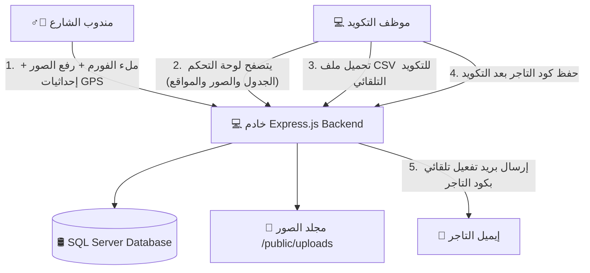

# يلا تاجر - نظام تسجيل وتكويد بيانات التجار 🚀
### Yalla Tager - Merchant Coding Form & Dashboard

نظام ويب متكامل مصمم خصيصاً لمشروع **"يلا تاجر"** لتسهيل عملية جمع بيانات التجار من مناديب الشارع وتكويدها بواسطة فريق العمل الخلفي (Backoffice)، بدلاً من الاعتماد على مجموعات الواتساب التقليدية التي تتسبب في بطء العمل وتساقط البيانات.

---

## 📊 مخطط هيكلية النظام (System Architecture)

يوضح المخطط التالي دورة حياة البيانات وانسيابيتها بين مندوب الشارع، السيرفر، قاعدة البيانات، وموظف التكويد:



---

## 📂 هيكلية ملفات المشروع (Project Folder Structure)

يحتوي المشروع على هيكلية منظمة تفصل بين الباك إند (Backend) والفرونت إند (Frontend) كالتالي:

```text
yallatagerform/
├── public/                       # ملفات الفرونت إند (الواجهة الأمامية) المتاحة للعامة
│   ├── uploads/                  # مجلد تخزين الصور المرفوعة (واجهة المتجر والبطاقات)
│   ├── favicon.png               # أيقونة التبويب الصغيرة في المتصفح (اللوجو المربع)
│   ├── yalla_tager_logo.png      # شعار يلا تاجر الرئيسي المستخدم في الواجهات (اللوجو الأفقي)
│   ├── index.html                # صفحة فورم التسجيل الخاصة بمندوب الشارع (عربي / إنجليزي)
│   ├── app.js                    # منطق فورم المندوب (الـ GPS، معاينة الصور، رفع البيانات)
│   ├── dashboard.html            # لوحة تحكم فريق التكويد (عرض البيانات، الفلاتر، التصدير)
│   ├── dashboard.js              # منطق لوحة التحكم (التفاعل، التصدير كـ CSV، الحفظ والتفعيل)
│   ├── login.html                # صفحة تسجيل دخول المدراء والمسؤولين
│   ├── login.js                  # منطق صفحة تسجيل الدخول والتحقق من الجلسة
│   └── styles.css                # ملف التنسيق الجمالي المشترك (تصميم Premium متجاوب)
├── .env                          # ملف متغيرات البيئة السرية (بيانات الاتصال بالسيرفر والـ SMTP والكابتشا)
├── server.js                     # الملف الرئيسي للباك إند (سيرفر Express والاتصال بقاعدة البيانات ومسارات الأمان)
└── package.json                  # ملف تعريف المشروع وإدارة المكتبات والاعتماديات
```

### 📝 شرح تفصيلي لكل ملف:
* **[public/uploads/](file:///c:/Users/SMART%20HOME/Documents/Uni-Group/yallatagerform/public/uploads)**: مجلد تخزين صور واجهات المحلات وبطاقات الرقم القومي المرفوعة بواسطة المناديب.
* **[public/favicon.png](file:///c:/Users/SMART%20HOME/Documents/Uni-Group/yallatagerform/public/favicon.png)**: شعار يلا تاجر المربع، مخصص للظهور في تبويبات المتصفح الصغيرة لإضفاء طابع احترافي.
* **[public/yalla_tager_logo.png](file:///c:/Users/SMART%20HOME/Documents/Uni-Group/yallatagerform/public/yalla_tager_logo.png)**: الشعار الأفقي الرسمي المندمج مع خلفية الصفحة والمستخدم كعنوان رئيسي.
* **[public/index.html](file:///c:/Users/SMART%20HOME/Documents/Uni-Group/yallatagerform/public/index.html)**: واجهة فورم التسجيل للمندوب، وتدعم اللغتين وتغيير اتجاهات الصفحة بالكامل.
* **[public/app.js](file:///c:/Users/SMART%20HOME/Documents/Uni-Group/yallatagerform/public/app.js)**: كود الواجهة المسؤول عن تشغيل الـ GPS، إظهار صور المعاينة قبل الرفع، وإرسال الفورم مع إظهار شريط التحميل.
* **[public/dashboard.html](file:///c:/Users/SMART%20HOME/Documents/Uni-Group/yallatagerform/public/dashboard.html)**: لوحة تحكم موظفي التكويد لعرض جدول التجار المسجلين وتصفيتهم.
* **[public/dashboard.js](file:///c:/Users/SMART%20HOME/Documents/Uni-Group/yallatagerform/public/dashboard.js)**: المسؤول عن التفاعل في لوحة التحكم، تحميل ملف الـ CSV وتحديث الحالة، وحفظ كود التاجر وتفعيل حسابه.
* **[public/login.html](file:///c:/Users/SMART%20HOME/Documents/Uni-Group/yallatagerform/public/login.html)**: بوابة تسجيل الدخول المؤمنة بالكامل والمحمية ضد الدخول غير المصرح به للوحة التحكم.
* **[public/login.js](file:///c:/Users/SMART%20HOME/Documents/Uni-Group/yallatagerform/public/login.js)**: يتعامل مع نداءات المصادقة بالباك إند، ويولد ملفات التوثيق ويحفظ الجلسة الآمنة.
* **[public/styles.css](file:///c:/Users/SMART%20HOME/Documents/Uni-Group/yallatagerform/public/styles.css)**: التنسيق الجمالي العام؛ يعتمد على خط Cairo والتأثيرات الحركية (Transitions) لضمان تجربة مستخدم راقية ومتجاوبة مع الهواتف الذكية.
* **[.env](file:///c:/Users/SMART%20HOME/Documents/Uni-Group/yallatagerform/.env)**: ملف خارجي لتخزين متغيرات بيئة العمل (مثل بورت السيرفر، خيارات تشفير وتفاصيل اتصال SQL Server، وحساب الـ SMTP لإرسال الإيميلات) لضمان الأمان والسهولة عند النقل للإنتاج.
* **[server.js](file:///c:/Users/SMART%20HOME/Documents/Uni-Group/yallatagerform/server.js)**: الكود الرئيسي للباك إند، يستقبل البيانات والصور، يقوم بالاتصال بـ SQL Server، يولد ملفات الـ CSV، ويرسل البريد الإلكتروني للتاجر.
* **[package.json](file:///c:/Users/SMART%20HOME/Documents/Uni-Group/yallatagerform/package.json)**: يحتوي على سجل المكتبات المستخدمة وأوامر التشغيل.

---

## 📚 التقنيات والمكتبات المستخدمة (Tech Stack & Libraries)

### 1. الباك إند (Backend):
* **Node.js (Express.js)**: البيئة البرمجية والإطار الأساسي لبناء السيرفر ومسارات الـ API.
* **[mssql](https://www.npmjs.com/package/mssql)** (Tedious Driver): المكتبة الرسمية الموصى بها للاتصال بقواعد بيانات Microsoft SQL Server بأمان وحماية من الـ SQL Injection عبر Parameterized Queries.
* **[multer](https://www.npmjs.com/package/multer)**: مكتبة لمعالجة ورفع الملفات والصور (Multipart/Form-Data) وحفظها محلياً بأسماء فريدة لمنع الكتابة فوق الملفات القديمة.
* **[nodemailer](https://www.npmjs.com/package/nodemailer)**: لإرسال إيميلات التفعيل التلقائية للتجار عبر بروتوكول SMTP بمجرد قيام فريق العمل بتكويدهم.
* **[dotenv](https://www.npmjs.com/package/dotenv)**: لتحميل متغيرات البيئة السرية من ملف `.env`.

### 2. الواجهة الأمامية (Frontend):
* **HTML5 & CSS3 Vanilla**: لضمان أقصى درجات التحكم في الواجهة والمرونة والتوافق مع محركات البحث SEO.
* **JavaScript (ES6+)**: للتحكم التفاعلي بالصفحات بدون الحاجة لأطر عمل معقدة تبطئ التحميل على الهواتف.
* **Bootstrap Icons (v1.11.3)**: مكتبة الأيقونات الرسمية المستخدمة بدلاً من الإيموجيز لتوفير واجهات متناسقة وراقية.
* **HTML5 Geolocation API**: للحصول على إحداثيات موقع المحل الدقيقة عبر GPS الهاتف مباشرة.
* **CSS mix-blend-mode**: لمعالجة خلفيات الشعارات المرفوعة ودمجها تلقائياً مع خلفية الصفحة لتظهر شفافة وبدون حدود مربعة.

---

## 🌟 الميزات المتقدمة وتجربة المستخدم (Advanced UX Features)

1. **البحث السريع والفوري (Instant Client-Side Search)**: شريط بحث مخصص في لوحة التحكم يتيح تصفية وفحص التجار لحظياً بكتابة الاسم، رقم الهاتف، أو الإيميل بدون إعادة تحميل الصفحة.
2. **نافذة التكويد المنبثقة (Activation Modal)**: تم استبدال حقول الإدخال المكدسة في الجدول بـ Modal تفاعلي أنيق يظهر بضغطة زر لتكويد التاجر وتفعيل حسابه مباشرة.
3. **تنزيل ملفات الـ CSV البرمجي (AJAX Blob Download)**: يتم تحميل وتصدير ملفات البيانات بالكامل في الخلفية باستخدام كائن Blob دون فتح تبويبات فارغة أو الانتقال لصفحات أخرى، ومعالجة عدم وجود بيانات برسائل تنبيهية لطيفة.
4. **التحديث التلقائي الذكي (Smart Auto-Refresh)**: عداد تنازلي نشط (60 ثانية) يظهر حالة السيرفر، مع دوران أيقونة التحديث حركياً لتوضيح نشاط النظام وجلب أي تجار جدد في الوقت الفعلي.
5. **جوجل كابتشا الذكية (Google reCAPTCHA v2)**: لحماية كاملة ضد الروبوتات وهجمات السبام، تم دمج كابتشا جوجل الرسمية ("أنا لست برنامج روبوت")، وتعمل محلياً بالكامل بفضل مفاتيح التطوير المعتمدة من جوجل للـ Localhost، مما يسمح باختبار النظام بدون الحاجة لتسجيل أي إعدادات إضافية.

---

## ⚙️ إعداد بيئة العمل والتشغيل (Setup Guide)

### 1. تهيئة خادم SQL Server محلياً:
لكي يتمكن التطبيق من الاتصال بـ SQL Server Express على جهازك، يجب تفعيل الاتصال عبر الشبكة وصلاحية المصادقة المختلطة كالتالي:
1. افتح **SQL Server Configuration Manager**.
2. اذهب إلى **SQL Server Network Configuration** -> **Protocols for SQLEXPRESS**.
3. اضغط بزر الماوس الأيمن على **TCP/IP** واختر **Enable**.
4. اضغط مرتين على **TCP/IP**، ثم انتقل لتبويب **IP Addresses**، وانزل لـ **IPAll** واجعل حقل *TCP Dynamic Ports* فارغاً، واكتب في حقل *TCP Port* القيمة `1433`.
5. افتح برنامج **SSMS**، واضغط بزر الماوس الأيمن على السيرفر واختر **Properties** -> صفحة **Security** -> فعل خيار **SQL Server and Windows Authentication mode** (المصادقة المختلطة).
6. فعل مستخدم الـ `sa` واكتب له كلمة مرور قوية.
7. اذهب لـ **SQL Server Services** واعمل **Restart** للخدمة **SQL Server (SQLEXPRESS)**.

### 2. ضبط ملف الإعدادات:
افتح ملف `.env` وقم بتعديله كالتالي:
```env
PORT=3000

# إعدادات SQL Server
DB_SERVER=localhost\SQLEXPRESS
DB_PORT=1433
DB_DATABASE=YallaTagerForm
DB_USER=sa
DB_PASSWORD=اكتب_هنا_باسورد_ال_sa
DB_ENCRYPT=false
DB_TRUST_SERVER_CERTIFICATE=true

# إعدادات إرسال الإيميل (SMTP)
SMTP_HOST=smtp.gmail.com
SMTP_PORT=587
SMTP_SECURE=false
SMTP_USER=بريدك_الإلكتروني
SMTP_PASS=كلمة_مرور_التطبيقات
SMTP_FROM="Yalla Tager <no-reply@yallatager.com>"

# إعدادات كابتشا جوجل (Google reCAPTCHA v2)
# المفاتيح الحالية هي مفاتيح اختبار جوجل وتعمل تلقائياً وبنجاح للـ localhost.
# للإنتاج (Production)، قم بتسجيل الدومين في لوحة تحكم الكابتشا واستبدل القيم ببياناتك.
RECAPTCHA_SITE_KEY=6LeIxAcTAAAAAJcZVRqyHh71UMIEGNQ_MXjiZKhI
RECAPTCHA_SECRET=6LeIxAcTAAAAAGG-vFI1qkvx2h0nFEP5cGFqpGA9

```

### 3. التشغيل:
افتح موجه الأوامر في مجلد المشروع، ثم شغل الأمر:
```bash
npm start
```
سيقوم السيرفر بالعمل على المنفذ: `http://localhost:3000` وسيقوم تلقائياً بفحص السيرفر وإنشاء قاعدة البيانات وجدول التجار بدون أي تدخل يدوي.

---

## 🌐 تفاصيل مسارات الـ API (API Reference)

> **⚠️ ملاحظة هامة للنشر (Production):** جميع نداءات الـ API البرمجية في كود الفرونت إند تم صياغتها بمسارات نسبية (Relative Paths) بدون شرطة مائلة بادئة (e.g. `api/merchants` بدلاً من `/api/merchants`). هذا يضمن توافق النظام تماماً مع خوادم البرودكشن ووكلاء التمرير العكسي (Reverse Proxies مثل Nginx) في حال تم استضافة التطبيق تحت مجلد فرعي (Subdirectory).

| المسار (Route) | نوع الطلب (Method) | الوصف (Description) | المدخلات (Payload) |
| :--- | :--- | :--- | :--- |
| `api/merchants` | `POST` | إرسال بيانات تاجر جديد من المندوب | `FormData` (الحقول النصية + الملفات الثنائية للصور) |
| `api/merchants` | `GET` | جلب قائمة التجار للوحة التحكم | `query params` (status, downloaded, uploaded) |
| `api/merchants/export/csv` | `GET` | تحميل ملف CSV للتجار الجدد | لا يوجد (يقوم بتحديث downloaded=1 تلقائياً) |
| `api/merchants/mark-uploaded` | `POST` | تعليم مجموعة تجار كـ "تم الرفع" | `json` يحتوي على مصفوفة معرّفات `{ ids: [1, 2, 3] }` |
| `api/merchants/:id/code` | `POST` | تكويد تاجر وحفظ كوده وإرسال إيميل التفعيل | `json` يحتوي على كود التاجر الجديد `{ merchant_code: "YT-XXXX" }` |

---

## 🔒 إعداد كابتشا جوجل للإنتاج (Google reCAPTCHA Production Guide)

التطبيق مجهز بنظام كابتشا ديناميكي ذكي للتحقق من البشر ومنع محاولات تسجيل الروبوتات السبام:
* **مرحلة التطوير المحلي (Local Development)**: يعمل التطبيق افتراضياً بمفاتيح اختبار جوجل الخاصة بالـ `localhost` والمكتوبة في ملف الـ `.env` بدون أي إعدادات إضافية.
* **مرحلة الإنتاج (Production)**:
  1. ادخل إلى [Google reCAPTCHA Console](https://www.google.com/recaptcha/admin) وأنشئ تطبيق كابتشا جديد من النوع **reCAPTCHA v2 ("I'm not a robot" Checkbox)**.
  2. أضف الدومين الخاص بإنتاج موقعكم (Domain Name).
  3. ستحصل على مفتاحين: `Site Key` و `Secret Key`.
  4. افتح ملف `.env` على سيرفر الإنتاج وقم بتعديل قيم `RECAPTCHA_SITE_KEY` و `RECAPTCHA_SECRET` بالمفاتيح الجديدة.
  5. سيقوم التطبيق بتحميل المفاتيح ديناميكياً وتفعيل الكابتشا الحقيقية وتختفي الرسالة التحذيرية الحمراء فوراً دون أي تعديل في كود الصفحات!

---

## 🛡️ نظام الأمان وتسجيل الدخول للمسؤولين (Dashboard Security & Authentication)

تم تأمين لوحة التحكم بالكامل ضد الوصول غير المصرح به بالاعتماد على أفضل معايير الأمان البرمجية:

### 1. مميزات نظام الأمان:
* **بوابة تسجيل الدخول الآمنة (`/login.html`)**: تم منع الدخول للوحة التحكم (`/dashboard.html`) للعامة؛ حيث يتم التحقق من بيانات المستخدم وإصدار تذكرة مشفرة وصالحة للاستخدام.
* **تشفير كلمات المرور بـ Bcrypt**: لا يتم حفظ كلمات المرور كنصوص واضحة في قاعدة البيانات؛ بل يتم تشفيرها وتمليحها باستخدام مكتبة `bcrypt` القوية.
* **التوثيق عبر JWT (JSON Web Token)**: بعد نجاح تسجيل الدخول، يتم إصدار توكن توثيق مشفر يحتوي على هوية المسؤول وصلاحياته.
* **كوكيز مشفرة ومحمية (`HttpOnly`)**: يتم تخزين التوكن في كوكيز المتصفح بخاصية `HttpOnly` (لمنع قراءة الجلسة عبر سكربتات خبيثة) وخاصية `SameSite: strict` (لمنع هجمات تزوير الطلبات CSRF).
* **حظر الوصول للمسارات الحساسة (`requireAuth`)**: جميع مسارات الـ APIs الخلفية التي تجلب بيانات التجار أو تصدر ملفات CSV محمية تماماً بالباك إند وتتطلب جلسة مسؤول نشطة للوصول.
* **الوقاية من ثغرات Stored XSS**: يتم تطهير النصوص (Sanitization) وتعقيم جميع حقول التجار المدخلة عبر دالة `escapeHtml` قبل رندرتها في جداول لوحة التحكم.
* **الوقاية من ثغرات SQL Injection**: جميع الاستعلامات الموجهة لقاعدة البيانات SQL Server مجهزة مسبقاً وممررة عبر متغيرات معزولة (`Parameterized Queries`).
* **سجل تدقيق الأمان (Security Audit Logs)**: يقوم السيرفر بطباعة ومراقبة جميع محاولات تسجيل الدخول الناجحة والفاشلة في الكونسول لتسهيل مراقبة أمان النظام.

### 2. الحساب الافتراضي للمسؤول الأول (Seeding):
* عند تشغيل السيرفر لأول مرة وكان جدول الحسابات فارغاً، يقوم النظام بإنشاء الحساب الافتراضي للمسؤول الأول تلقائياً في قاعدة البيانات.
* **اسم المستخدم الافتراضي**: `admin`
* **كلمة المرور الافتراضية**: *(يرجى مراجعة إعدادات التشغيل أو استخراجها من ملف البيئة `.env` في حقل `ADMIN_PASSWORD` لعدم كتابة الباسوردات في المستندات المتاحة للعامة)*.

### 3. إدارة حسابات المسؤولين الإضافية:
* تم توفير واجهة مستخدم منبثقة (Modal) مدمجة في الهيدر بجانب زر الخروج لإدارة حسابات المسؤولين.
* لا يمكن لأي شخص إضافة مسؤول جديد إلا إذا كان قد سجل الدخول بالفعل كمسؤول نشط، ويتم فحص الصلاحية في الباك إند قبل إتمام الإضافة.
